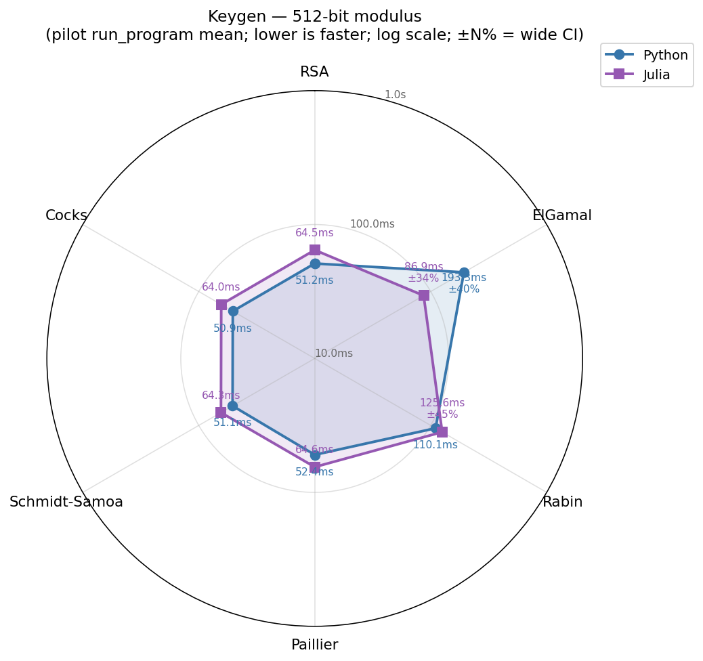
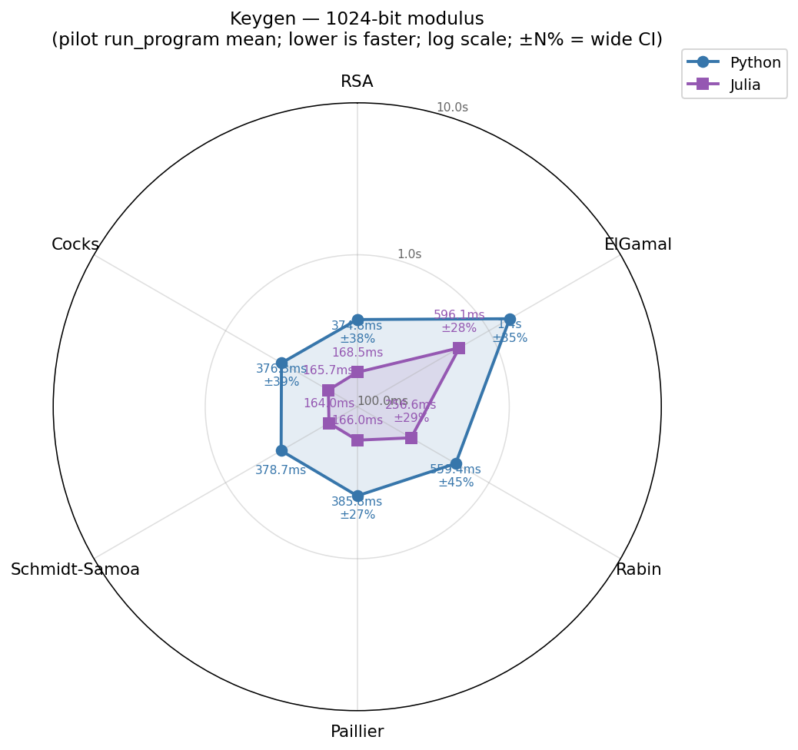
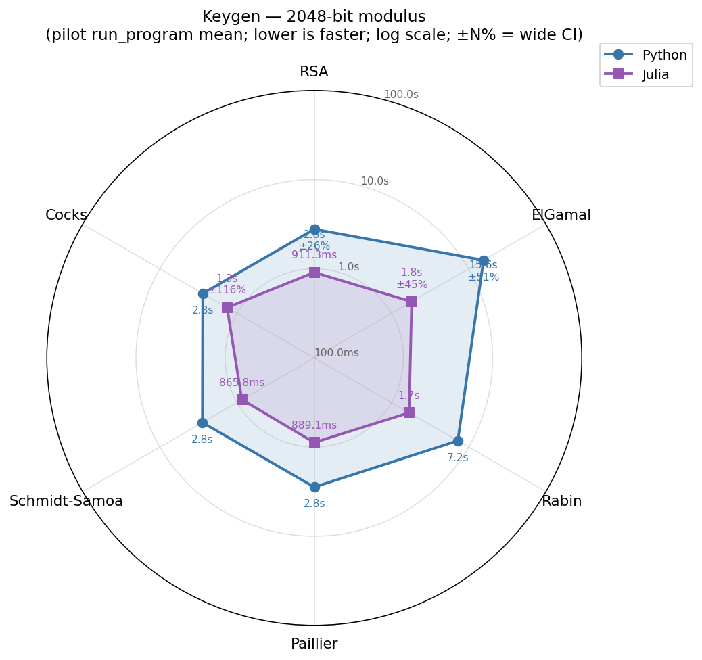
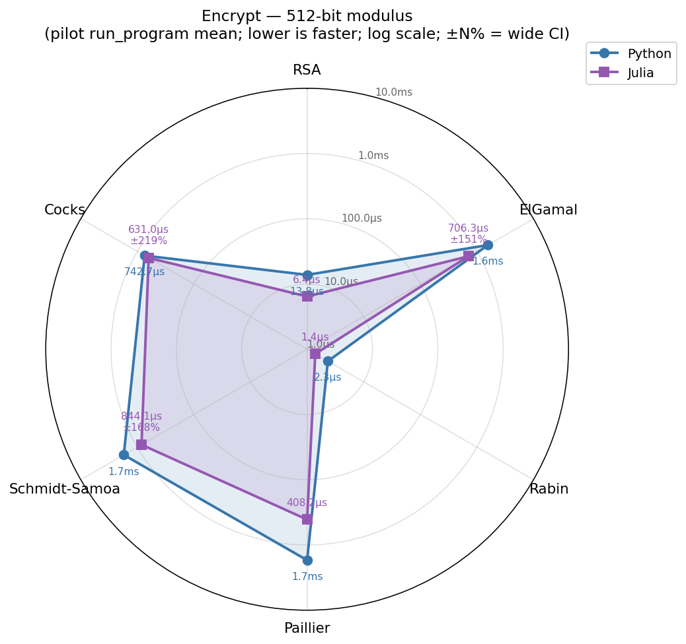
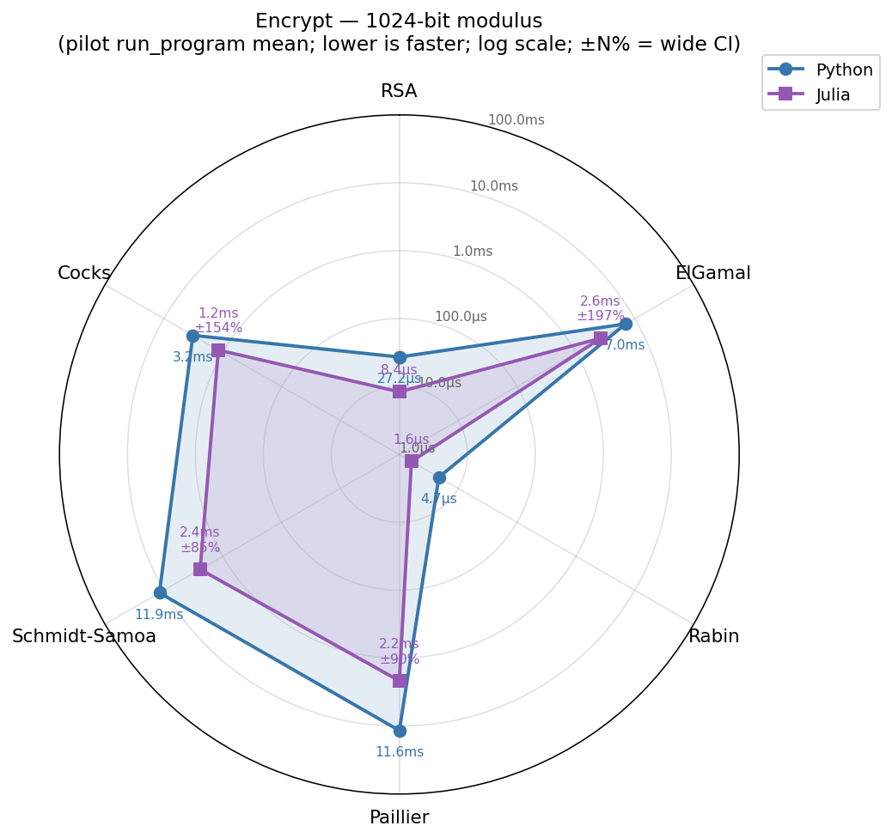
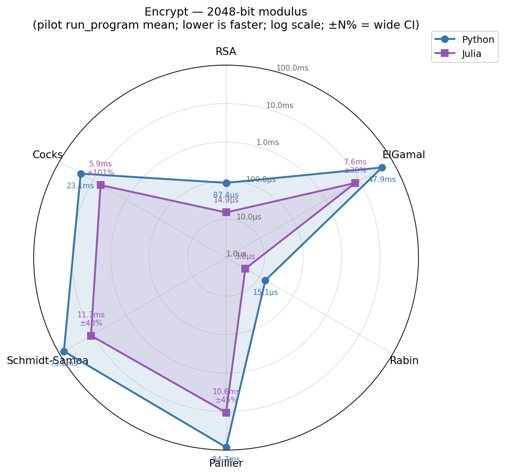
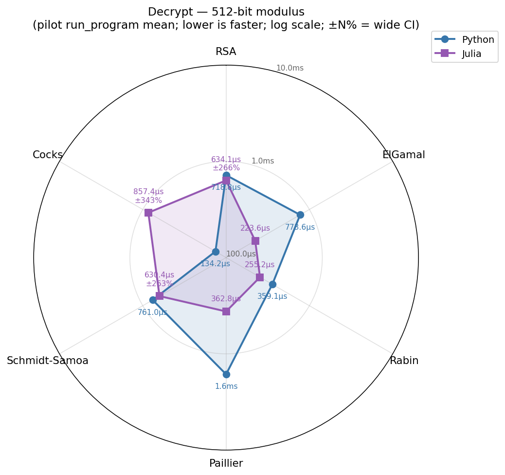
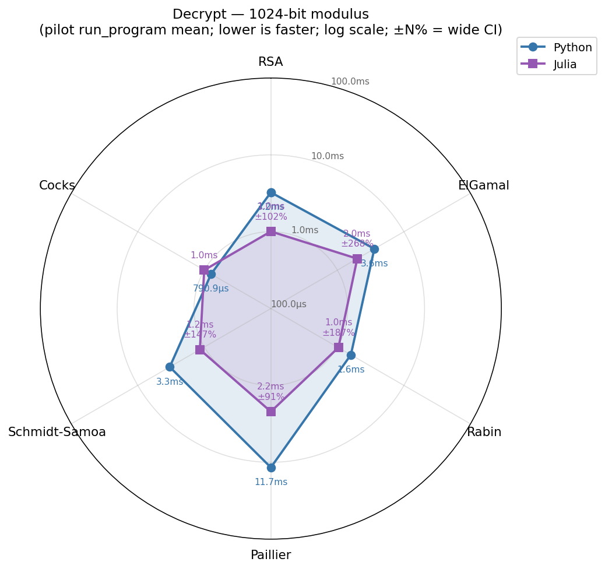
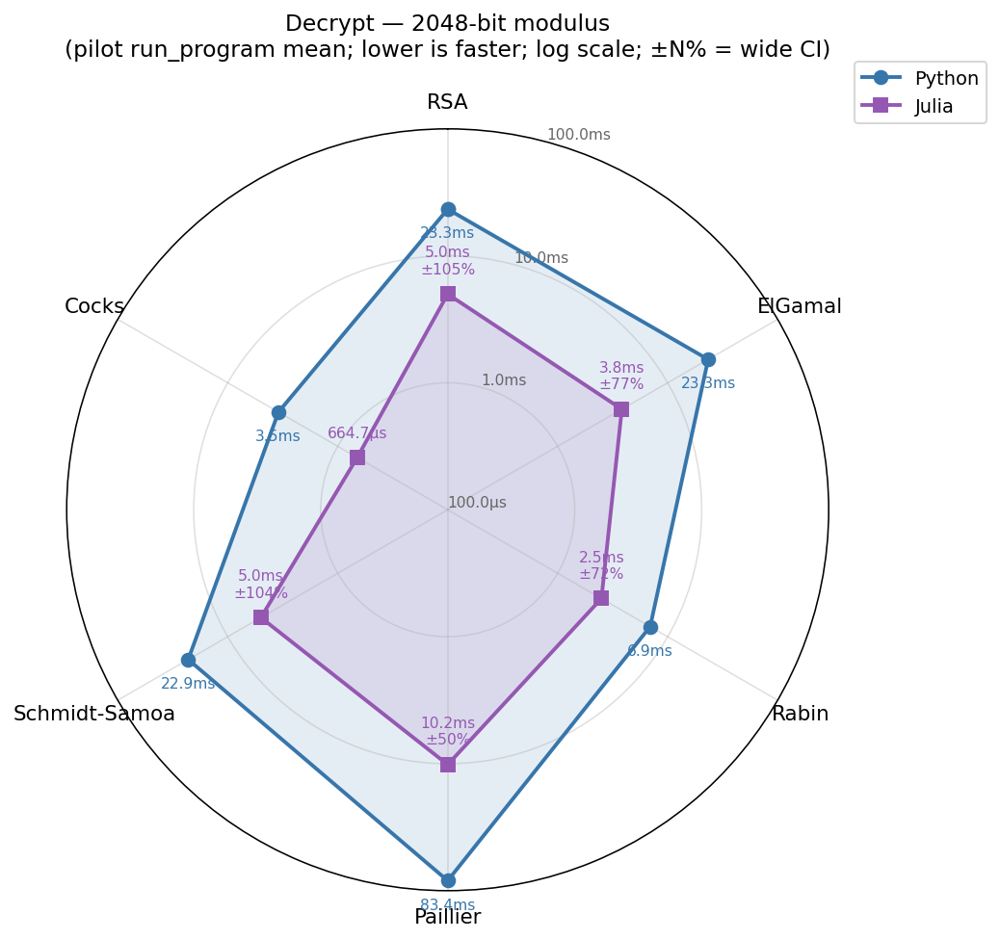

# Performance: Python vs. Julia

A like-for-like benchmark of the six cryptosystems in this repository and its
sibling [Public-key-Cryptography-in-Python](../Public-key-Cryptography-in-Python)
(or, from the Python side, the Julia repo), across three modulus sizes and
three operations:

- **Algorithms:** RSA, ElGamal, Rabin, Paillier, Schmidt-Samoa, Cocks (1973).
- **Operations:** key generation, encryption, decryption.
- **Modulus sizes:** 512, 1024, 2048 bits.
- **Languages:** Python 3 (CPython, native `int`) and Julia 1.12 (`BigInt` via GMP).

Both implementations share identical algorithms and wire formats (verified by
80 cross-language interop checks during development). Differences in measured
time are differences in language and runtime overhead, not algorithmic
differences. Both runs use *random* primes (`safe=False`); the safe-prime path
is much slower and would dominate the wall.

## Methodology

- **Tool:** [Pilot Benchmark Framework](https://github.com/darrelllong/pilot-bench)
  driven through `bench run_program`. Pilot adaptively re-invokes each driver
  until autocorrelation drops and confidence interval converges, then reports
  the converged mean. Where the configured session limit is reached before
  convergence, pilot reports the mean it has and an honest CI; this report
  surfaces every CI &gt; 25% in the tables and chart annotations.
- **Drivers:** `bench/py_bench.py` (this/the Python repo) and `bench/jl_bench.jl`
  (this/the Julia repo). Each driver invocation generates a fresh key for
  *keygen* timing, or generates one key and reuses it for *encrypt* / *decrypt*.
  All operations use the same plaintext: `encode("benchmark")`. Per-iteration
  timings (microseconds) are emitted to stdout; pilot consumes them as samples.
- **Per-round iterations (K):** sized so each driver invocation amortises
  process startup; pilot decides round count. K ranges from 5 (slow keygen
  at 2048 bits) to 500 (fast encrypt/decrypt at 512 bits).
- **Hardware:** Apple Silicon, macOS 25.4.0. Python 3 from Homebrew; Julia 1.12.6.

### Known asymmetries to read with care

1. **Random keys differ between languages.** Each driver seeds its own RNG
   (`random.seed(20260506)` in Python; `Random.seed!(20260506)` in Julia).
   The bit-lengths of generated primes are identical by construction, but
   the specific values are not. For *encrypt* and *decrypt* the cost is a
   function of `e`, `d`, and the modulus *bit-length*, which match; for
   *keygen* the cost depends on which candidates the prime sieve happens
   to encounter, which does not. Treat keygen ratios as approximate.
2. **GC variance shows up where the operation is short.** A 5 ms GC pause
   inside a 5 s keygen round is invisible; the same pause on top of a
   200 µs decrypt poisons the round mean. Cells with CI &gt; 100% are pilot
   reporting that the sample distribution is not stationary on this
   machine; longer per-cell session limits will tighten them.
3. **One re-run cell** (`julia,cocks,decrypt,2048`) was rerun standalone
   with K=10 instead of K=100 because the original K=100 round was
   unbounded in pilot's grace window. Different K means a different N
   for that cell — the steady-state mean (664.7 µs ± 1.8%) agrees with
   the pattern across the row, but it is the only cell in the table where
   K differs from the schedule in `bench/run_all.py`.
4. **Two cells were slow enough that pilot's session limit (initially
   120 s) was not enough.** Python ElGamal keygen 2048 (one keygen ≈ 10 s
   wall) and Python Rabin keygen 2048 (≈ 7 s wall) were re-run with a 600 s
   limit. ElGamal still has ±79% CI even after that — random ElGamal
   keygen at 2048 bits has a heavy-tailed distribution dominated by
   prime-search variance.

## Summary of results

At modulus sizes of 1024 bits and above — the regime that matters for
practical cryptography — Julia is consistently faster than Python on
nearly every operation. Of the 15 cells in which both implementations
converged at a confidence interval at or below 25 %, Julia is the faster
language in 13. The largest separations occur at 2048 bits:
ElGamal key generation runs 8.5× faster in Julia, Paillier encryption
8.0× faster, and Paillier decryption 8.2× faster.

At 512-bit key generation Julia is approximately 20 % slower than Python
for most schemes. The cause is arithmetic granularity: at 256-bit primes
each modular multiplication is cheap enough that BigInt allocation and
garbage-collection overhead dominate the per-operation cost, and
CPython's specialised small-integer path remains competitive. ElGamal-512
key generation is the exception: its dominant cost is generator search
rather than prime construction, which keeps Julia ahead even at small
moduli.

Several decryption cells at 512 and 1024 bits — including RSA-512,
ElGamal-1024, Rabin-1024, every Schmidt-Samoa decryption, and most Cocks
decryptions — show confidence intervals exceeding 100 %. These cells
illustrate the well-known difficulty of timing sub-millisecond operations
on a managed runtime: an occasional GC pause that is invisible against a
multi-second key generation thoroughly distorts the round mean of a
200-microsecond decryption. The means in those cells are reported with
their uncertainty so that no false claim of advantage rests on
noise-dominated samples.

## Charts

Each radar has six spokes (one per algorithm) and two polygons (Python in
blue, Julia in purple). The radial axis is log10 of microseconds; closer to
the centre is faster. Cells whose CI exceeds 25% show the percentage so
they can be read with appropriate scepticism.

### Key generation
| 512-bit | 1024-bit | 2048-bit |
|:---:|:---:|:---:|
|  |  |  |

### Encryption
| 512-bit | 1024-bit | 2048-bit |
|:---:|:---:|:---:|
|  |  |  |

### Decryption
| 512-bit | 1024-bit | 2048-bit |
|:---:|:---:|:---:|
|  |  |  |

## Tables

Means in mixed units. *Italics* mark pilot's CI as a percentage of the mean
when it exceeds 25%; those cells reflect non-stationary samples (typically
GC variance) and should be read with the noted uncertainty.

### Keygen

| Algorithm | Bits | Python | Julia | Julia speedup |
|---|---:|---:|---:|---:|
| RSA | 512 | 51.20 ms | 65.08 ms *(±28%)* | 0.79× |
| RSA | 1024 | 374.79 ms *(±38%)* | 168.52 ms | **2.22×** |
| RSA | 2048 | 2.78 s *(±30%)* | 911.34 ms *(±25%)* | **3.05×** |
| ElGamal | 512 | 193.26 ms *(±48%)* | 86.91 ms *(±41%)* | **2.22×** |
| ElGamal | 1024 | 1.44 s *(±35%)* | 596.08 ms *(±28%)* | **2.41×** |
| ElGamal | 2048 | 15.58 s *(±79%)* | 1.83 s *(±54%)* | **8.53×** |
| Rabin | 512 | 108.66 ms *(±37%)* | 125.61 ms *(±55%)* | 0.87× |
| Rabin | 1024 | 559.39 ms *(±45%)* | 256.60 ms *(±29%)* | **2.18×** |
| Rabin | 2048 | 7.22 s | 1.69 s *(±51%)* | **4.28×** |
| Paillier | 512 | 52.41 ms | 63.66 ms | 0.82× |
| Paillier | 1024 | 385.76 ms *(±27%)* | 166.00 ms | **2.32×** |
| Paillier | 2048 | 2.81 s *(±31%)* | 892.87 ms | **3.15×** |
| Schmidt-Samoa | 512 | 51.09 ms | 62.33 ms *(±29%)* | 0.82× |
| Schmidt-Samoa | 1024 | 378.72 ms | 163.99 ms | **2.31×** |
| Schmidt-Samoa | 2048 | 2.81 s | 871.01 ms | **3.23×** |
| Cocks | 512 | 50.86 ms | 63.89 ms *(±26%)* | 0.80× |
| Cocks | 1024 | 376.35 ms *(±39%)* | 165.74 ms | **2.27×** |
| Cocks | 2048 | 2.79 s | 1.73 s *(±200%)* | **1.61×** |

### Encrypt

| Algorithm | Bits | Python | Julia | Julia speedup |
|---|---:|---:|---:|---:|
| RSA | 512 | 13.8 µs | 6.4 µs | **2.14×** |
| RSA | 1024 | 27.2 µs | 8.4 µs | **3.26×** |
| RSA | 2048 | 87.4 µs | 14.9 µs | **5.86×** |
| ElGamal | 512 | 1.56 ms | 706.3 µs *(±181%)* | **2.21×** |
| ElGamal | 1024 | 6.99 ms | 2.65 ms *(±197%)* | **2.64×** |
| ElGamal | 2048 | 47.87 ms | 7.56 ms *(±46%)* | **6.33×** |
| Rabin | 512 | 2.3 µs | 1.2 µs | **1.91×** |
| Rabin | 1024 | 4.7 µs | 1.6 µs | **2.92×** |
| Rabin | 2048 | 15.1 µs | 3.8 µs | **4.00×** |
| Paillier | 512 | 1.71 ms | 408.2 µs | **4.19×** |
| Paillier | 1024 | 11.63 ms | 2.16 ms *(±90%)* | **5.39×** |
| Paillier | 2048 | 84.51 ms | 10.59 ms *(±54%)* | **7.98×** |
| Schmidt-Samoa | 512 | 1.75 ms | 844.1 µs *(±202%)* | **2.07×** |
| Schmidt-Samoa | 1024 | 11.91 ms | 2.42 ms *(±85%)* | **4.92×** |
| Schmidt-Samoa | 2048 | 73.59 ms | 11.31 ms *(±48%)* | **6.50×** |
| Cocks | 512 | 742.2 µs | 631.0 µs *(±264%)* | **1.18×** |
| Cocks | 1024 | 3.22 ms | 1.19 ms *(±154%)* | **2.71×** |
| Cocks | 2048 | 23.12 ms | 5.85 ms *(±121%)* | **3.95×** |

### Decrypt

| Algorithm | Bits | Python | Julia | Julia speedup |
|---|---:|---:|---:|---:|
| RSA | 512 | 718.8 µs | 634.1 µs *(±266%)* | **1.13×** |
| RSA | 1024 | 3.25 ms | 1.01 ms *(±102%)* | **3.22×** |
| RSA | 2048 | 23.31 ms | 5.00 ms *(±105%)* | **4.66×** |
| ElGamal | 512 | 773.6 µs | 223.6 µs | **3.46×** |
| ElGamal | 1024 | 3.59 ms | 1.99 ms *(±268%)* | **1.81×** |
| ElGamal | 2048 | 23.34 ms | 3.83 ms *(±77%)* | **6.09×** |
| Rabin | 512 | 359.1 µs | 255.2 µs | **1.41×** |
| Rabin | 1024 | 1.59 ms | 1.04 ms *(±187%)* | **1.54×** |
| Rabin | 2048 | 6.93 ms | 2.50 ms *(±72%)* | **2.77×** |
| Paillier | 512 | 1.63 ms | 362.8 µs | **4.49×** |
| Paillier | 1024 | 11.68 ms | 2.19 ms *(±91%)* | **5.33×** |
| Paillier | 2048 | 83.45 ms | 10.17 ms *(±50%)* | **8.21×** |
| Schmidt-Samoa | 512 | 761.0 µs | 630.4 µs *(±263%)* | **1.21×** |
| Schmidt-Samoa | 1024 | 3.31 ms | 1.17 ms *(±147%)* | **2.84×** |
| Schmidt-Samoa | 2048 | 22.86 ms | 4.99 ms *(±104%)* | **4.58×** |
| Cocks | 512 | 134.2 µs | 857.4 µs *(±343%)* | 0.16× |
| Cocks | 1024 | 790.9 µs | 1.00 ms | 0.79× |
| Cocks | 2048 | 3.46 ms | 664.7 µs | **5.20×** |

## Reproducing

Both repos contain the harness; from either repo's root:

```bash
# 1. Build pilot-bench (one time):
git clone https://github.com/darrelllong/pilot-bench ../pilot-bench
cmake -S ../pilot-bench -B ../pilot-bench/build -DCMAKE_BUILD_TYPE=Release -DWITH_TUI=OFF
cmake --build ../pilot-bench/build -j

# 2. Run a single cell:
../pilot-bench/build/cli/bench run_program \
    --pi "lat,us,0,0,1" --ci-perc 10 --preset quick \
    --session-limit 60 -o /tmp/pilot_rsa \
    -- julia --startup-file=no bench/jl_bench.jl rsa decrypt 2048 100

# 3. Full sweep (one Python process drives both languages):
python3 bench/run_all.py            # writes results to $BENCH_OUT (default /tmp/bench_data/)
python3 bench/plot_radars.py        # 9 PNGs into $BENCH_OUT/charts/
```

Override the bench binary location with `PILOT_BENCH=...` and the output
directory with `BENCH_OUT=...`. The full sweep takes ~45 minutes on Apple
Silicon; the two slow Python ElGamal/Rabin keygen 2048 cells were re-run
with a 600 s session limit (so add ~20 minutes if you re-run those).

The CSV used to generate this report is committed at
`assets/perf/results.csv`. The chart PNGs are at `assets/perf/*.png`.
Re-running on different hardware will produce different absolute numbers,
but the language-comparison shape should be similar.

## On the wide-CI cells

Several Julia cells — particularly Cocks/SS encrypt and decrypt at small
key sizes, and the 512-bit RSA/Rabin decrypt cells — show CIs over 100%.
This is pilot reporting honestly that the sample distribution is not
stationary: a few rounds among the converged sample took noticeably
longer than the rest, almost always because of GC pauses on short
measurements (a 5 ms GC pause is invisible against a 5 s keygen but
catastrophic against a 200 µs decrypt). The point of pilot is that this
is *visible* in the result, not silently averaged out.

For decisive comparisons in those cells, longer per-cell session limits
and larger per-round iteration counts will tighten the CI; pilot will
keep going as long as you let it. The session limits used for this
report were chosen to finish a full 108-cell sweep in roughly the time
budget of one airplane Wi-Fi session.
