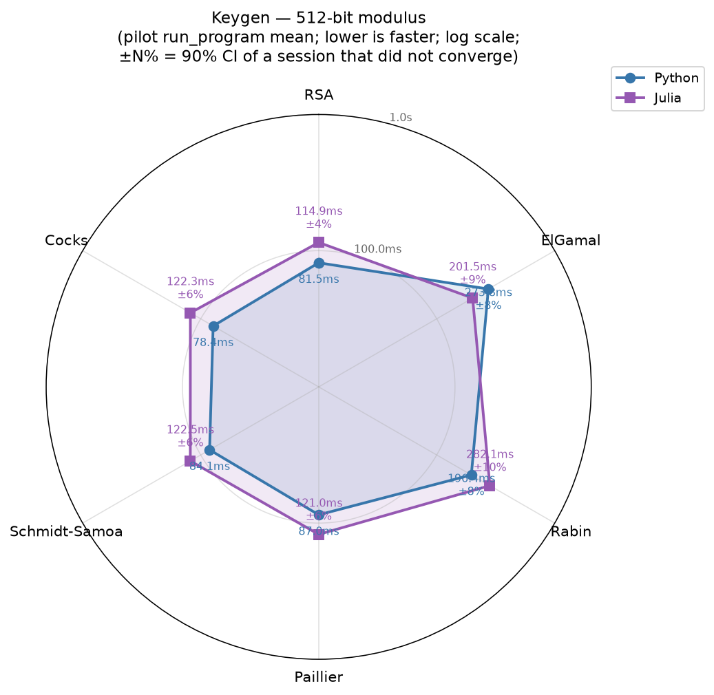
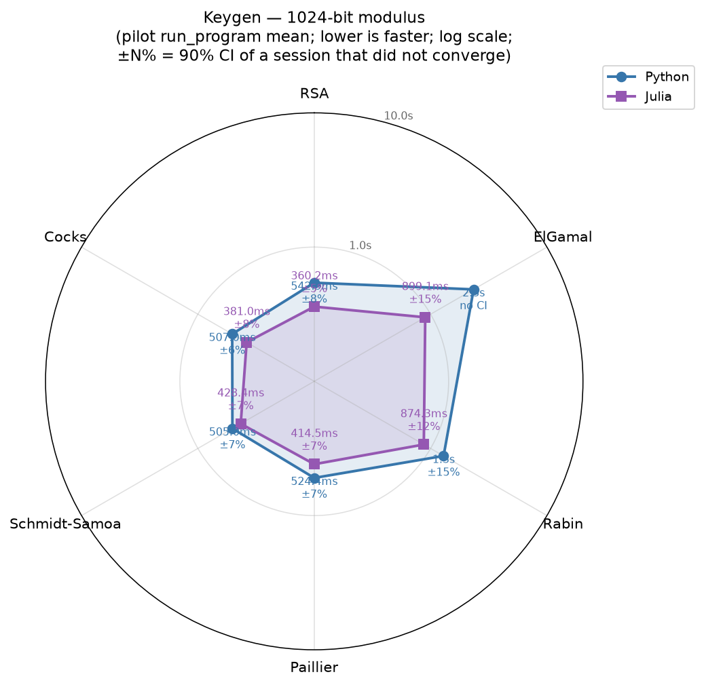
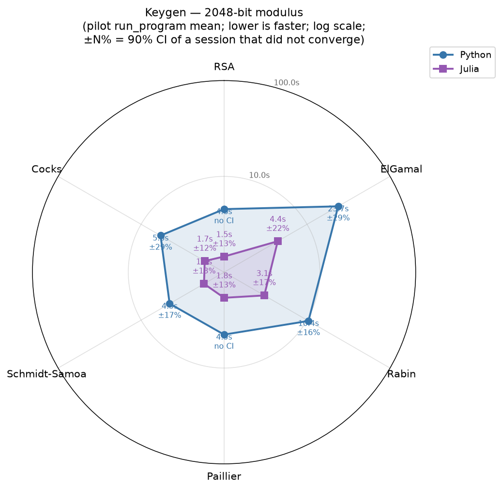
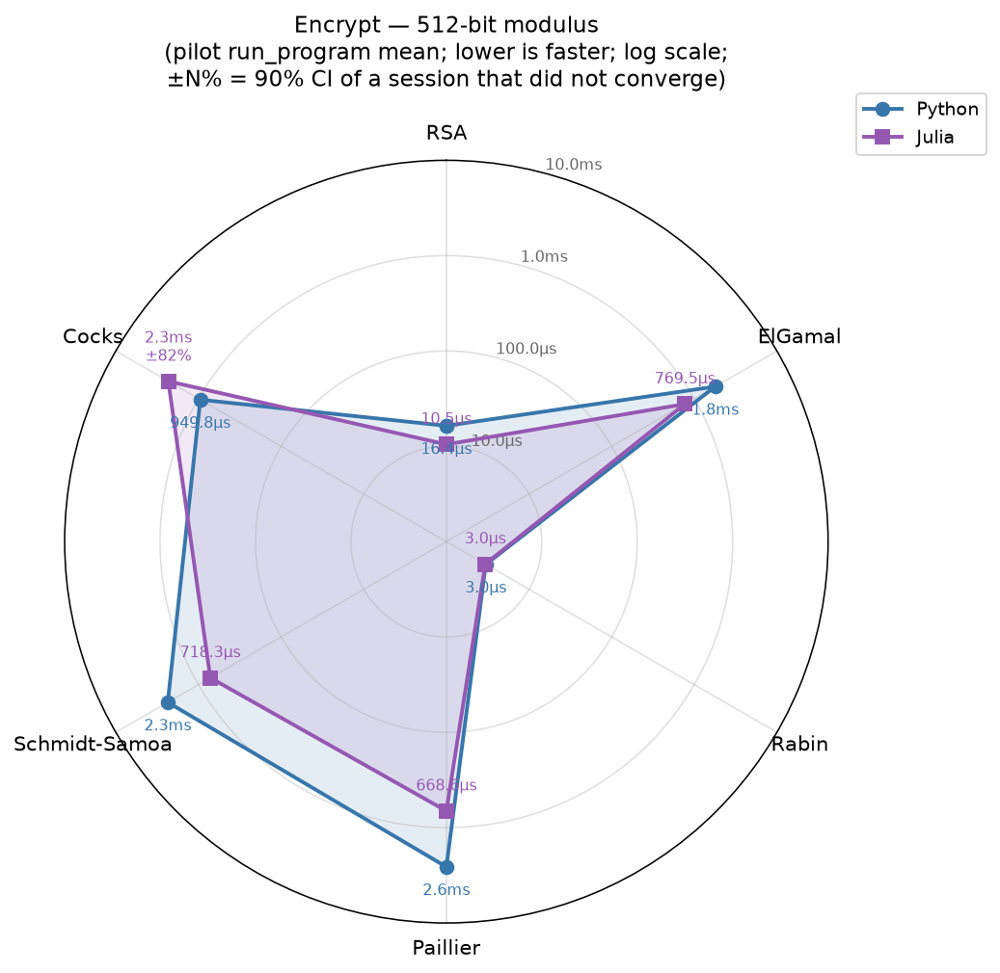
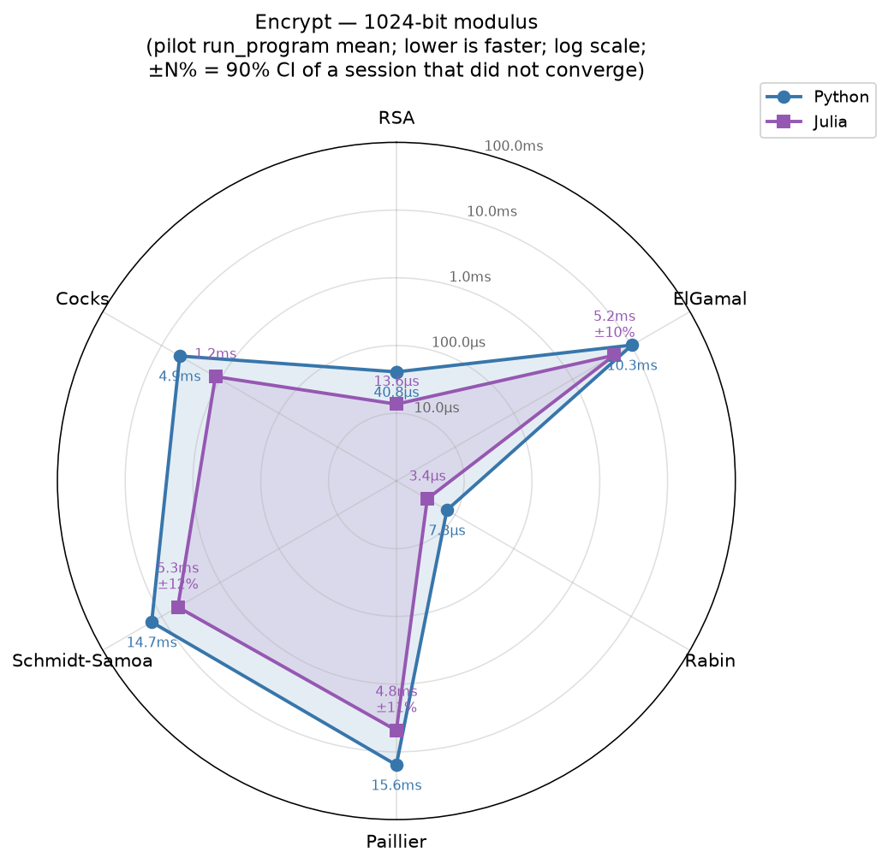
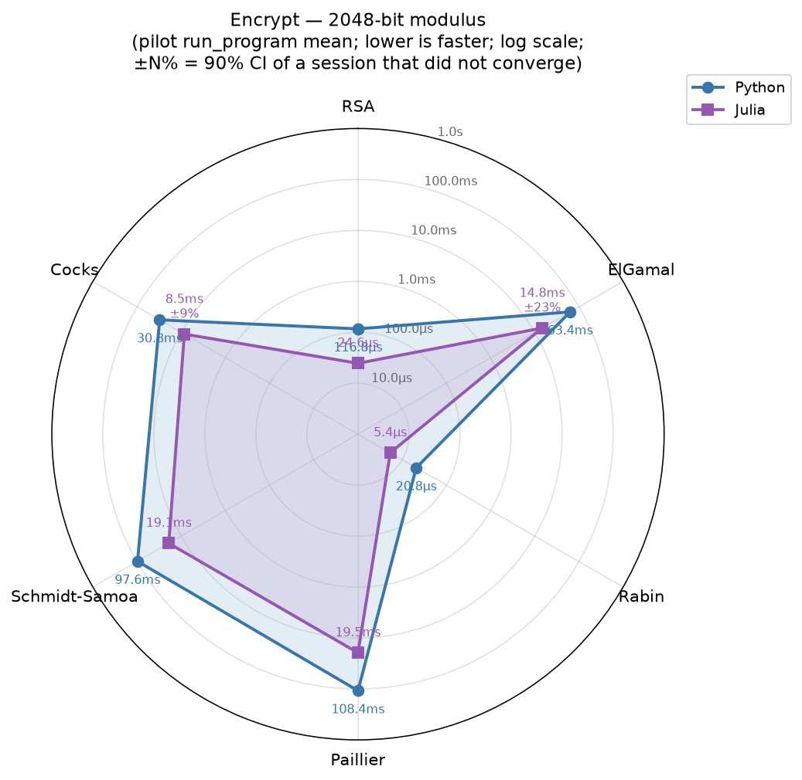
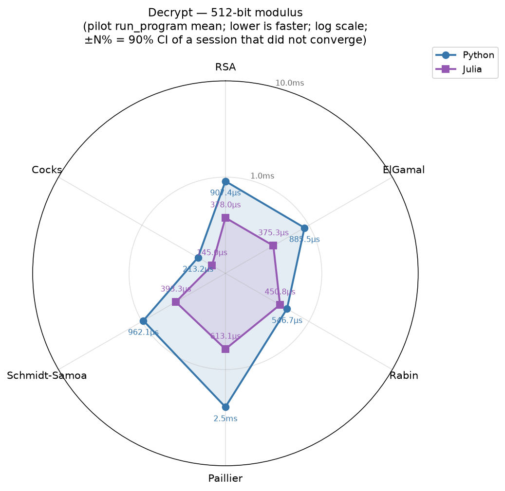
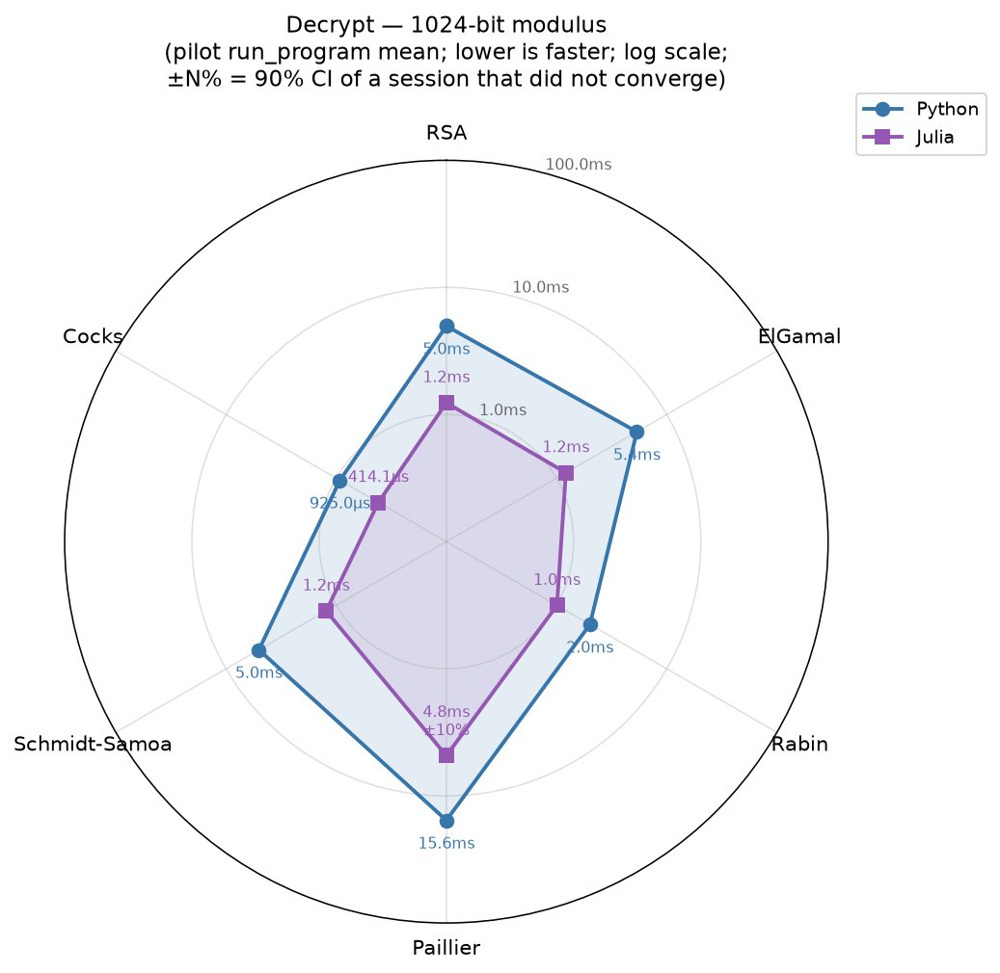
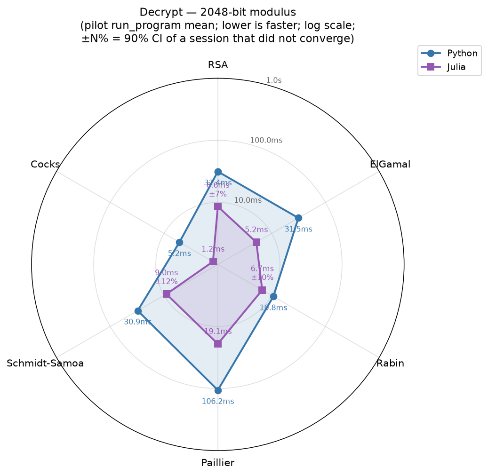

# Performance: Python vs. Julia

A like-for-like benchmark of the six cryptosystems in this repository and
its sibling
[Public-key-Cryptography-in-Python](../Public-key-Cryptography-in-Python)
(or, from the Python side, the Julia repo), across three modulus sizes and
three operations:

- **Algorithms:** RSA, ElGamal, Rabin, Paillier, Schmidt-Samoa, Cocks
  (1973).
- **Operations:** key generation, encryption, decryption.
- **Modulus sizes:** 512, 1024, 2048 bits.
- **Languages:** Python 3 (CPython, native `int`) and Julia 1.12 (`BigInt`
  via GMP).

Both implementations share identical algorithms and wire formats (verified
by 80 cross-language interop checks during development). Both runs use
*random* primes (`safe=False`); the safe-prime path is much slower and would
dominate the wall.

The results below were measured on 2026-09-28 with Pilot commit `f01eec4`.
They replace the results of May 2026, which were measured on Apple Silicon
with an earlier Pilot and an earlier version of the harness; those are kept,
with their defects described, in
[Earlier results](#earlier-results-apple-silicon-may-2026-pilot-before-f01eec4).

## Methodology

- **Tool:**
  [Pilot Benchmark Framework](https://github.com/darrelllong/pilot-bench),
  commit `f01eec4`, driven through `bench run_program` by
  `bench/run_all.py`. The driver prints one timing per line; Pilot takes
  each line as one reading and runs the driver again when its output is used
  up. Pilot drops the readings before the last change-point it detects (the
  warm-up) and stops when the confidence interval of the mean is narrow
  enough or when the session limit is reached.
- **Session requirements:** `--preset quick --ci-perc 0.10`: the 95%
  confidence interval must be no wider than 10% of the mean (±5%), with at
  least 30 readings. The quick preset states an autocorrelation limit of
  0.8, but Pilot `f01eec4` computes the required sample size with its
  library default of 0.1 (`pilot_optimal_sample_size()` is called without
  the limit), so 0.1 is the limit that the sessions used.
- **Session limits:** key generation 30, 60, 120 s at 512, 1024, 2048 bits;
  encryption and decryption 30, 30, 60 s. Python ElGamal and Rabin key
  generation at 2048 bits take several seconds per key and have 600 s. A
  session that reaches its limit ends with exit code 13 and reports the mean
  and interval of the readings it has; such a session has *not converged*,
  and is marked in the tables and charts.
- **Confidence level:** the sessions run at Pilot's default of 0.95. After
  each session, the readings Pilot used are re-analysed with `bench analyze
  -a 0.1 --cl 0.90`, which gives the 90% interval. Every ±N% in the tables
  and charts is the half-width of the 90% interval as a percentage of the
  mean. (Pilot reports the full width of the interval.)
- **Drivers:** `bench/py_bench.py` (Python repo) and `bench/jl_bench.jl`
  (Julia repo). For *keygen*, each driver invocation generates K fresh keys,
  with the random number generator seeded from the operating system, so that
  every invocation draws different keys. For *encrypt* and *decrypt*, each
  invocation generates one key from the fixed seed 20260506 and times K
  operations with it; every invocation of a cell therefore measures the same
  key. All operations use the plaintext `encode("benchmark")`. Timings are
  in microseconds.
- **Per-invocation iterations (K):** keygen 20, 10, 5 at 512, 1024, 2048
  bits; encrypt and decrypt 500, 200, 100.
- **Process handling:** when a session ends Pilot sends SIGTERM to the
  driver. A Julia driver can survive it, either sleeping or running on the
  CPU, and it then competed with the next cell. The harness now runs each
  session in a process group of its own and kills what is left of the group
  when Pilot exits.
- **Machine:** `dmz`, Intel Core i5-8259U (4 cores, 8 threads, 2.3 GHz,
  turbo enabled, `powersave` governor), Ubuntu 26.04.1 LTS, Linux
  7.0.0-31-generic. Python 3.14.4 (Ubuntu package); Julia 1.12.6 (official
  binary, GMP 6.3.0). Both halves of the sweep ran with `taskset -c 3`
  (Pilot, the drivers and the analysis on logical CPU 3), with nothing else
  running on the machine.

### Known asymmetries to read with care

1. **Encryption and decryption keys differ between languages.** Both drivers
   seed their generator with 20260506, but the generators differ, so the two
   languages measure different keys of the same size. The cost of these
   operations depends on the bit-lengths of the modulus and exponents, which
   match, and to a smaller degree on the particular values, which do not.
2. **Key generation is a random process.** Its cost depends on how many
   candidates the prime search tests. The keygen means are means over the
   random keys that each session drew; the Python and Julia sessions drew
   different keys.
3. **Short operations and garbage collection.** A garbage-collection pause
   that is small against a key generation is large against a decryption of a
   few hundred microseconds. Ten of the 36 Julia encryption and decryption
   sessions did not converge; all 36 Python ones did.

## Summary of results

All 108 cells were measured. 66 sessions converged and 42 reached their
session limit: 14 Python sessions (key generation, every size except 512
bits for RSA, Paillier, Schmidt-Samoa and Cocks) and 28 Julia sessions (all
18 key generation sessions, and 10 encryption and decryption sessions).

In the 26 cells in which both sessions converged, Julia is faster in all 26;
in 25 of them the two 90% intervals do not overlap. The exception is Rabin
encryption at 512 bits, where the two means differ by 1% and the intervals
overlap. The largest ratios among these cells are at 2048 bits: ElGamal
decryption 6.05× faster in Julia, Paillier decryption 5.56× and Paillier
encryption 5.55×.

Key generation at 512 bits is faster in Python for RSA, Rabin, Paillier,
Schmidt-Samoa and Cocks (Julia speedup 0.64× to 0.72×, with intervals that
do not overlap), and faster in Julia for ElGamal (1.36×). At 1024 and 2048
bits Julia generates keys faster for every algorithm, by 1.18× to 5.35×;
none of these sessions converged, in either language, so these ratios carry
the intervals shown in the table. This report does not measure why the
512-bit key generation is slower in Julia.

Cocks encryption at 512 bits is the one other cell in which Julia's mean is
the larger (0.41×). That Julia session did not converge (±82%): of its 5,505
readings the median is 387 µs, and 18 exceed 100 ms.

The ratios are measured constants for these two implementations on this
machine. The algorithms are the same in both languages, so the order of
growth in the modulus size is the same; the tables measure three sizes and
do not by themselves establish an order of growth.

## Charts

Each radar has six spokes (one per algorithm) and two polygons (Python in
blue, Julia in purple). The radial axis is log10 of microseconds; closer to
the centre is faster. A cell whose Pilot session did not converge shows its
90% interval as ±N% of the mean, or "no CI" where Pilot could not compute
one.

### Key generation
| 512-bit | 1024-bit | 2048-bit |
|:---:|:---:|:---:|
|  |  |  |

### Encryption
| 512-bit | 1024-bit | 2048-bit |
|:---:|:---:|:---:|
|  |  |  |

### Decryption
| 512-bit | 1024-bit | 2048-bit |
|:---:|:---:|:---:|
|  |  |  |

## Tables

Means in mixed units, each with the half-width of its 90% confidence
interval as a percentage of the mean. *Italics* mark a session that reached
its session limit before its interval was narrow enough. "no CI" marks the
three Python key-generation sessions (RSA and Paillier at 2048 bits, ElGamal
at 1024 bits) that ended with 21 readings, from which Pilot could not choose
a subsession size that meets the autocorrelation limit, so it has no
interval. The speedup is the Python mean divided by the Julia mean; **bold**
marks cells in which Julia is faster and the two 90% intervals do not
overlap.

### Keygen

| Algorithm | Bits | Python | Julia | Julia speedup |
|---|---:|---:|---:|---:|
| RSA | 512 | 81.52 ms (±4.2%) | 114.93 ms *(±4.0%)* | 0.71× |
| RSA | 1024 | 542.88 ms *(±7.8%)* | 360.25 ms *(±5.2%)* | **1.51×** |
| RSA | 2048 | 4.55 s *(no CI)* | 1.46 s *(±13%)* | 3.12× |
| ElGamal | 512 | 273.85 ms *(±7.8%)* | 201.46 ms *(±9.3%)* | **1.36×** |
| ElGamal | 1024 | 2.34 s *(no CI)* | 899.08 ms *(±15%)* | 2.60× |
| ElGamal | 2048 | 23.73 s *(±29%)* | 4.43 s *(±22%)* | **5.35×** |
| Rabin | 512 | 196.39 ms *(±7.8%)* | 282.06 ms *(±10%)* | 0.70× |
| Rabin | 1024 | 1.29 s *(±15%)* | 874.25 ms *(±12%)* | **1.48×** |
| Rabin | 2048 | 10.40 s *(±16%)* | 3.05 s *(±17%)* | **3.41×** |
| Paillier | 512 | 86.96 ms (±4.2%) | 121.04 ms *(±5.9%)* | 0.72× |
| Paillier | 1024 | 524.42 ms *(±6.9%)* | 414.46 ms *(±7.1%)* | **1.27×** |
| Paillier | 2048 | 4.48 s *(no CI)* | 1.85 s *(±13%)* | 2.42× |
| Schmidt-Samoa | 512 | 84.05 ms (±4.2%) | 122.46 ms *(±5.7%)* | 0.69× |
| Schmidt-Samoa | 1024 | 505.00 ms *(±7.0%)* | 428.40 ms *(±6.9%)* | **1.18×** |
| Schmidt-Samoa | 2048 | 4.53 s *(±17%)* | 1.74 s *(±13%)* | **2.60×** |
| Cocks | 512 | 78.43 ms (±4.2%) | 122.30 ms *(±6.3%)* | 0.64× |
| Cocks | 1024 | 506.99 ms *(±5.5%)* | 381.04 ms *(±7.5%)* | **1.33×** |
| Cocks | 2048 | 5.83 s *(±29%)* | 1.71 s *(±12%)* | **3.41×** |

### Encrypt

| Algorithm | Bits | Python | Julia | Julia speedup |
|---|---:|---:|---:|---:|
| RSA | 512 | 16.4 µs (±1.0%) | 10.5 µs (±0.7%) | **1.57×** |
| RSA | 1024 | 40.8 µs (±0.6%) | 13.6 µs (±0.5%) | **2.99×** |
| RSA | 2048 | 116.8 µs (±0.3%) | 24.6 µs (±1.3%) | **4.74×** |
| ElGamal | 512 | 1.79 ms (±0.4%) | 769.5 µs (±2.4%) | **2.33×** |
| ElGamal | 1024 | 10.31 ms (±0.3%) | 5.17 ms *(±9.9%)* | **2.00×** |
| ElGamal | 2048 | 63.41 ms (±0.3%) | 14.76 ms *(±23%)* | **4.30×** |
| Rabin | 512 | 3.0 µs (±4.2%) | 3.0 µs (±4.2%) | 1.01× |
| Rabin | 1024 | 7.3 µs (±4.0%) | 3.4 µs (±2.4%) | **2.16×** |
| Rabin | 2048 | 20.8 µs (±0.8%) | 5.4 µs (±4.1%) | **3.87×** |
| Paillier | 512 | 2.58 ms (±0.6%) | 668.6 µs (±2.4%) | **3.86×** |
| Paillier | 1024 | 15.62 ms (±0.1%) | 4.82 ms *(±11%)* | **3.24×** |
| Paillier | 2048 | 108.42 ms (±1.3%) | 19.54 ms (±4.2%) | **5.55×** |
| Schmidt-Samoa | 512 | 2.35 ms (±0.8%) | 718.3 µs (±4.2%) | **3.27×** |
| Schmidt-Samoa | 1024 | 14.71 ms (±0.5%) | 5.28 ms *(±12%)* | **2.78×** |
| Schmidt-Samoa | 2048 | 97.60 ms (±0.2%) | 19.13 ms (±4.2%) | **5.10×** |
| Cocks | 512 | 949.8 µs (±1.4%) | 2.31 ms *(±82%)* | 0.41× |
| Cocks | 1024 | 4.90 ms (±0.3%) | 1.21 ms (±1.3%) | **4.06×** |
| Cocks | 2048 | 30.83 ms (±0.1%) | 8.51 ms *(±8.7%)* | **3.62×** |

### Decrypt

| Algorithm | Bits | Python | Julia | Julia speedup |
|---|---:|---:|---:|---:|
| RSA | 512 | 907.4 µs (±1.0%) | 378.0 µs (±4.1%) | **2.40×** |
| RSA | 1024 | 4.97 ms (±0.2%) | 1.24 ms (±0.8%) | **4.02×** |
| RSA | 2048 | 31.41 ms (±0.1%) | 8.56 ms *(±7.4%)* | **3.67×** |
| ElGamal | 512 | 885.5 µs (±0.1%) | 375.3 µs (±0.4%) | **2.36×** |
| ElGamal | 1024 | 5.36 ms (±1.0%) | 1.22 ms (±0.8%) | **4.41×** |
| ElGamal | 2048 | 31.48 ms (±0.3%) | 5.20 ms (±1.6%) | **6.05×** |
| Rabin | 512 | 546.7 µs (±0.1%) | 450.8 µs (±1.6%) | **1.21×** |
| Rabin | 1024 | 2.01 ms (±0.2%) | 1.01 ms (±0.3%) | **1.99×** |
| Rabin | 2048 | 10.81 ms (±1.1%) | 6.69 ms *(±10%)* | **1.61×** |
| Paillier | 512 | 2.45 ms (±0.2%) | 613.1 µs (±2.4%) | **4.00×** |
| Paillier | 1024 | 15.58 ms (±0.1%) | 4.83 ms *(±10%)* | **3.23×** |
| Paillier | 2048 | 106.21 ms (±0.1%) | 19.09 ms (±4.2%) | **5.56×** |
| Schmidt-Samoa | 512 | 962.1 µs (±0.5%) | 393.3 µs (±3.5%) | **2.45×** |
| Schmidt-Samoa | 1024 | 5.03 ms (±0.1%) | 1.23 ms (±0.9%) | **4.08×** |
| Schmidt-Samoa | 2048 | 30.92 ms (±0.2%) | 9.04 ms *(±12%)* | **3.42×** |
| Cocks | 512 | 213.2 µs (±0.2%) | 145.0 µs (±2.5%) | **1.47×** |
| Cocks | 1024 | 925.0 µs (±0.1%) | 414.1 µs (±1.2%) | **2.23×** |
| Cocks | 2048 | 5.18 ms (±0.1%) | 1.23 ms (±2.9%) | **4.20×** |

## Reproducing

Both repos contain the harness; from either repo's root:

```bash
# 1. Build pilot-bench (one time):
git clone https://github.com/darrelllong/pilot-bench ../pilot-bench
cmake -S ../pilot-bench -B ../pilot-bench/build -DCMAKE_BUILD_TYPE=Release -DWITH_TUI=OFF
cmake --build ../pilot-bench/build -j

# 2. Run a single cell:
../pilot-bench/build/cli/bench run_program \
    --pi "lat,us,0,0,1" --ci-perc 0.10 --preset quick \
    --session-limit 60 -o /tmp/pilot_rsa \
    -- julia --startup-file=no bench/jl_bench.jl rsa decrypt 2048 100

# 3. Full sweep (one Python process drives both languages), pinned to one CPU:
taskset -c 3 python3 bench/run_all.py   # writes results to $BENCH_OUT (default /tmp/bench_data/)
python3 bench/plot_radars.py            # 9 PNGs into $BENCH_OUT/charts/ (needs matplotlib)
```

`--ci-perc` takes a fraction of the mean: 0.10 is 10%. Override the bench
binary with `PILOT_BENCH=...`, the julia executable with `JULIA=...`, the
output directory with `BENCH_OUT=...`, and run one language only with
`BENCH_LANGS=python` or `BENCH_LANGS=julia`. On `dmz` the Python half took
43 minutes and the Julia half 32 minutes (the sums of the per-cell wall
times in the CSV). The two halves were run one after the other with
`BENCH_LANGS` and their rows put together in one file.

The CSV used to generate this report is committed at
`assets/perf/results.csv`; its columns are described at the top of
`bench/run_all.py`. The chart PNGs are at `assets/perf/*.png`.

## Earlier results (Apple Silicon, May 2026, Pilot before f01eec4)

The first version of this report was measured on Apple Silicon (macOS
25.4.0, Python 3 from Homebrew, Julia 1.12.6), with a Pilot built before
commit `f01eec4`. Its CSV is kept at
`assets/perf/results-2026-05-apple-silicon.csv`. It cannot be rerun here,
and it should not be compared cell by cell with the results above, for these
reasons:

1. **The CI requirement was not in force.** The harness passed `--ci-perc
   10`. The option takes a fraction, so this required an interval no wider
   than 1000% of the mean, and a session ended as soon as it had Pilot's
   minimum sample size (30 subsession samples) after the last change-point,
   or at the session limit.
2. **The ±N% were full widths.** They were the full width of the 90%
   interval as a percentage of the mean, twice the half-width that the ±
   notation means.
3. **Key generation repeated the same keys.** The drivers seeded their
   generator with a fixed value in every invocation, so each invocation
   generated the same K keys, and the readings repeated with period K. The
   keygen means were means over those K keys.
4. **Change-point detection.** The Pilot of that time accepted a first
   change-point whether or not there was one, and used only the readings
   after it (see `doc/changelog.rst` in pilot-bench).
5. **One cell** (`julia,cocks,decrypt,2048`) was run on its own with K=10
   instead of K=100, and the Python ElGamal and Rabin 2048-bit keygen cells
   were run again with a 600 s session limit.

The confidence intervals below were computed at the 95% level during the
sweep and recomputed at 90% with `bench analyze --cl 0.90`. Each ±N% is a
full width (item 2). Italics marked a full width above 25% of the mean, and
bold marked every speedup above 1.

Compared with those results, on the different machine and with the corrected
method: the Julia Cocks decryption at 512 and 1024 bits, then slower than
Python (0.16× and 0.78×), is now faster (1.47× and 2.23×), with converged
sessions; Julia Cocks encryption at 512 bits, then 1.18×, is now 0.41× in a
session that did not converge; and the largest ratio, ElGamal key generation
at 2048 bits, is 5.35× instead of 8.53×. Most of the Julia encryption and
decryption intervals that were wider than 100% of the mean are now below
±5%.

#### Keygen (Apple Silicon, May 2026)

| Algorithm | Bits | Python | Julia | Julia speedup |
|---|---:|---:|---:|---:|
| RSA | 512 | 51.20 ms (±13%) | 64.53 ms (±8.7%) | 0.79× |
| RSA | 1024 | 375.37 ms (±14%) | 166.50 ms (±6.6%) | **2.25×** |
| RSA | 2048 | 2.78 s *(±26%)* | 911.34 ms (±21%) | **3.05×** |
| ElGamal | 512 | 193.26 ms *(±40%)* | 86.91 ms *(±34%)* | **2.22×** |
| ElGamal | 1024 | 1.44 s *(±42%)* | 538.23 ms (±15%) | **2.67×** |
| ElGamal | 2048 | 15.58 s *(±51%)* | 1.83 s *(±45%)* | **8.53×** |
| Rabin | 512 | 110.13 ms (±13%) | 125.61 ms *(±45%)* | 0.88× |
| Rabin | 1024 | 563.26 ms (±17%) | 257.67 ms (±11%) | **2.19×** |
| Rabin | 2048 | 7.22 s (±5.3%) | 1.69 s (±23%) | **4.27×** |
| Paillier | 512 | 52.41 ms (±15%) | 64.63 ms (±8.2%) | 0.81× |
| Paillier | 1024 | 385.27 ms (±14%) | 166.12 ms (±6.2%) | **2.32×** |
| Paillier | 2048 | 2.81 s (±23%) | 889.07 ms (±11%) | **3.16×** |
| Schmidt-Samoa | 512 | 51.09 ms (±15%) | 64.31 ms (±8.5%) | 0.79× |
| Schmidt-Samoa | 1024 | 378.38 ms (±14%) | 162.76 ms (±6.0%) | **2.32×** |
| Schmidt-Samoa | 2048 | 2.81 s (±24%) | 865.77 ms (±11%) | **3.25×** |
| Cocks | 512 | 50.86 ms (±14%) | 64.00 ms (±8.0%) | 0.79× |
| Cocks | 1024 | 376.43 ms (±14%) | 165.32 ms (±6.2%) | **2.28×** |
| Cocks | 2048 | 2.79 s (±24%) | 1.35 s *(±116%)* | **2.07×** |

#### Encrypt (Apple Silicon, May 2026)

| Algorithm | Bits | Python | Julia | Julia speedup |
|---|---:|---:|---:|---:|
| RSA | 512 | 13.8 µs (±1.9%) | 6.4 µs (±17%) | **2.14×** |
| RSA | 1024 | 27.2 µs (±0.5%) | 8.4 µs (±10%) | **3.26×** |
| RSA | 2048 | 87.4 µs (±0.6%) | 14.9 µs (±5.7%) | **5.86×** |
| ElGamal | 512 | 1.56 ms (±1.0%) | 706.3 µs *(±151%)* | **2.21×** |
| ElGamal | 1024 | 6.99 ms (±0.6%) | 2.65 ms *(±163%)* | **2.64×** |
| ElGamal | 2048 | 47.94 ms (±0.4%) | 7.56 ms *(±38%)* | **6.34×** |
| Rabin | 512 | 2.3 µs (±1.8%) | 1.4 µs (±21%) | **1.67×** |
| Rabin | 1024 | 4.8 µs (±2.9%) | 2.0 µs (±23%) | **2.40×** |
| Rabin | 2048 | 15.1 µs (±0.5%) | 3.8 µs (±13%) | **4.00×** |
| Paillier | 512 | 1.71 ms (±0.3%) | 408.2 µs (±1.6%) | **4.19×** |
| Paillier | 1024 | 11.63 ms (±0.2%) | 2.16 ms *(±75%)* | **5.39×** |
| Paillier | 2048 | 84.71 ms (±0.3%) | 10.59 ms *(±45%)* | **8.00×** |
| Schmidt-Samoa | 512 | 1.74 ms (±1.7%) | 844.1 µs *(±168%)* | **2.06×** |
| Schmidt-Samoa | 1024 | 11.51 ms (±3.0%) | 2.42 ms *(±70%)* | **4.75×** |
| Schmidt-Samoa | 2048 | 73.59 ms (±0.4%) | 11.31 ms *(±40%)* | **6.50×** |
| Cocks | 512 | 742.7 µs (±0.5%) | 631.0 µs *(±219%)* | **1.18×** |
| Cocks | 1024 | 3.25 ms (±1.0%) | 1.19 ms *(±128%)* | **2.73×** |
| Cocks | 2048 | 23.09 ms (±0.5%) | 5.85 ms *(±101%)* | **3.94×** |

#### Decrypt (Apple Silicon, May 2026)

| Algorithm | Bits | Python | Julia | Julia speedup |
|---|---:|---:|---:|---:|
| RSA | 512 | 718.8 µs (±0.3%) | 634.1 µs *(±221%)* | **1.13×** |
| RSA | 1024 | 3.25 ms (±0.5%) | 1.01 ms *(±85%)* | **3.22×** |
| RSA | 2048 | 23.46 ms (±0.7%) | 5.00 ms *(±87%)* | **4.69×** |
| ElGamal | 512 | 790.6 µs (±2.1%) | 223.6 µs (±3.9%) | **3.54×** |
| ElGamal | 1024 | 3.60 ms (±0.3%) | 1.99 ms *(±222%)* | **1.81×** |
| ElGamal | 2048 | 23.36 ms (±0.2%) | 3.83 ms *(±64%)* | **6.09×** |
| Rabin | 512 | 359.5 µs (±0.5%) | 250.8 µs (±1.8%) | **1.43×** |
| Rabin | 1024 | 1.59 ms (±0.4%) | 1.04 ms *(±155%)* | **1.54×** |
| Rabin | 2048 | 6.93 ms (±0.2%) | 2.50 ms *(±59%)* | **2.77×** |
| Paillier | 512 | 1.63 ms (±0.3%) | 362.8 µs (±1.6%) | **4.49×** |
| Paillier | 1024 | 11.68 ms (±0.1%) | 2.19 ms *(±76%)* | **5.32×** |
| Paillier | 2048 | 83.45 ms (±0.1%) | 10.17 ms *(±42%)* | **8.21×** |
| Schmidt-Samoa | 512 | 761.0 µs (±0.2%) | 630.4 µs *(±219%)* | **1.21×** |
| Schmidt-Samoa | 1024 | 3.31 ms (±0.3%) | 1.17 ms *(±122%)* | **2.84×** |
| Schmidt-Samoa | 2048 | 22.88 ms (±0.1%) | 4.99 ms *(±87%)* | **4.58×** |
| Cocks | 512 | 134.2 µs (±1.3%) | 857.4 µs *(±285%)* | 0.16× |
| Cocks | 1024 | 790.9 µs (±1.6%) | 1.01 ms (±2.2%) | 0.78× |
| Cocks | 2048 | 3.46 ms (±0.3%) | 664.7 µs (±1.5%) | **5.20×** |
